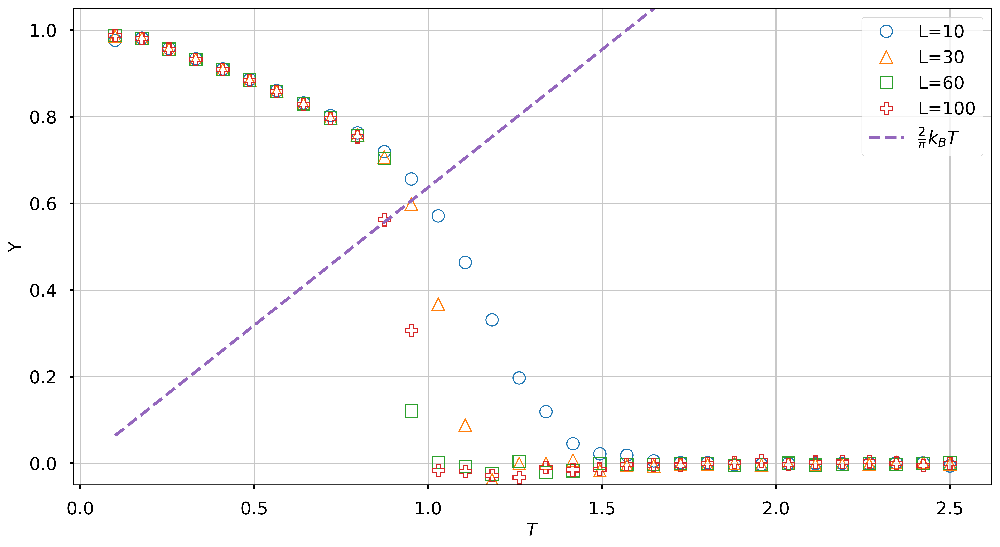
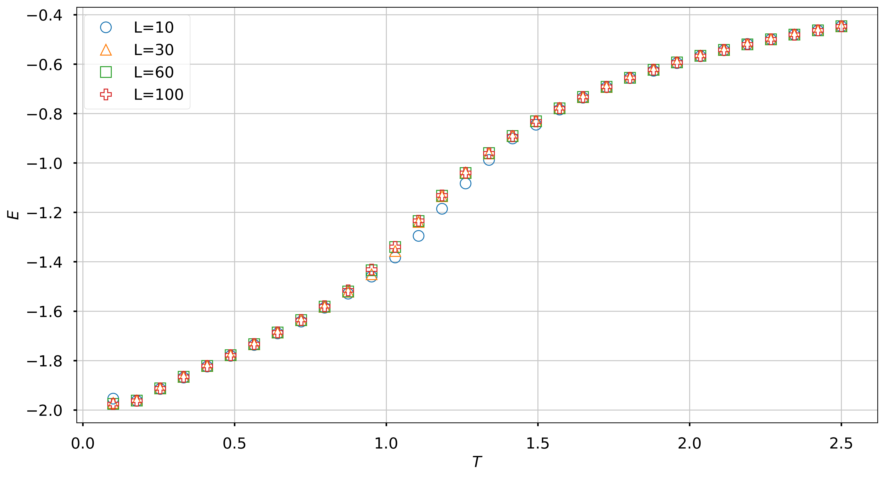
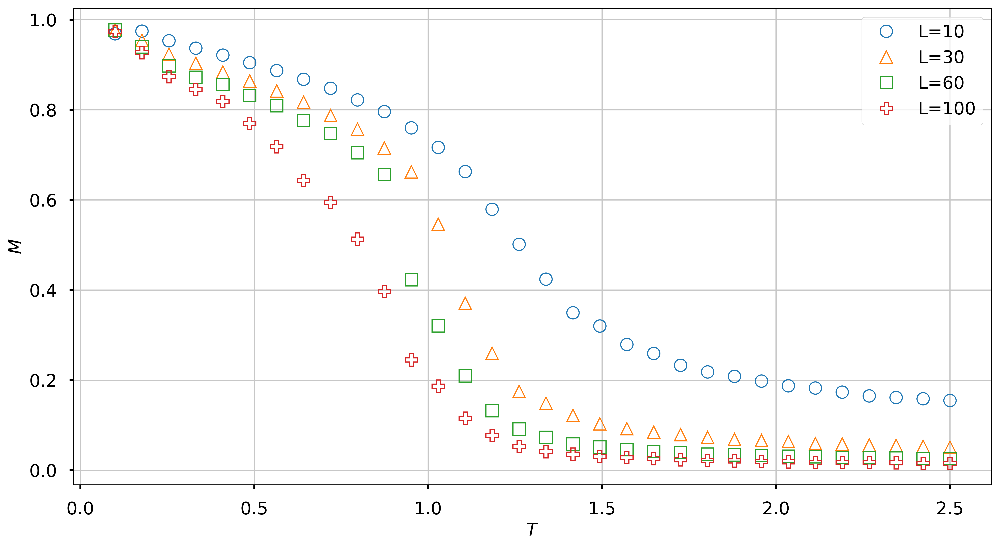

# Simulation of XY model

***
Running on **Heroku** - https://xy-model.herokuapp.com/

***
XY model is lattice model of statistical mechanics. 

**The spin configuration**

**The configuration energy**

}J_{ij}&space;s_i&space;\cdot&space;s_j&space;=&space;-\sum_{<ij>}&space;J_{ij}&space;\cos&space;(\theta_i&space;-&space;\theta_j)" title="H(s) = - \sum_{<ij>}J_{ij} s_i \cdot s_j = -\sum_{<ij>} J_{ij} \cos (\theta_i - \theta_j)" />

*Helicity modulus*

*Energy*

*Magnetization*

*Magnetic Susceptibility*
